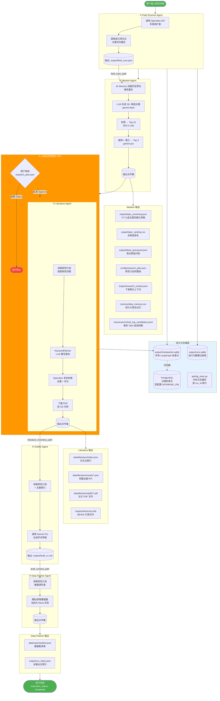

# Auto-PI 数据收集与存储流程文档

## 概述

Auto-PI 采用多智能体流水线架构，通过 LangGraph 编排 5 个专业 Agent 顺序执行。Agent 之间通过**文件路径引用**传递数据（而非内联传递大型数据结构），确保内存效率与模块化设计。

---

## 流程图



---

## 数据流详解

### 状态对象（ResearchState）

Agent 间传递的状态是一个 `TypedDict`，仅包含**文件路径**，不内联存储实际数据：

```python
class ResearchState(TypedDict):
    domain_input: str               # 用户输入的研究领域
    field_scan_path: str            # → output/field_scan.json
    candidate_topics_path: str      # → output/topic_screening.json
    current_plan_path: str          # → config/research_plan.json
    literature_inventory_path: str  # → data/literature/index.json
    draft_content_path: str         # → output/Draft_v1.md
    raw_data_manifest_path: str     # → data/raw/manifest.json
    research_context_path: str      # → output/research_context.json
    execution_status: str           # 当前执行状态
```

`execution_status` 的生命周期：
```
starting → ideation → harvesting → drafting → fetching → completed
```

---

## 各 Agent 数据收集详情

### ① Field Scanner Agent

**数据来源：** OpenAlex API

**收集内容：**
- 领域内高引用论文（标题、作者、年份、DOI、摘要）
- 出版期刊与引用次数
- 研究概念/关键词及权重
- OA 状态与 PDF 链接
- 多查询命中统计

**输出文件：**

| 文件 | 格式 | 关键字段 |
|------|------|---------|
| `output/field_scan.json` | JSON | `domain_scanned`, `search_strategy`, `query_hits`, `openalex_traction`, `keywords` |

---

### ② Ideation Agent

**数据来源：** Field Scan 结果 + LLM（Gemini）+ Memory

**处理流程：**
1. 从 `memory/idea_memory.csv` 加载历史想法（按领域匹配），注入 LLM Prompt 避免重复
2. `gemini-flash` 生成 30+ 候选主题
3. 初步评分筛选至 Top 10（阈值：分数 ≥ 0）
4. `gemini-pro` 对 Top 10 进行深度评分与富化，选出 Top 3
5. 生成完整研究计划（包含 RQ、假设、方法、量化规格）

**输出文件：**

| 文件 | 格式 | 关键字段 |
|------|------|---------|
| `output/topic_screening.json` | JSON | `run_id`, `candidates[]`（含量化规格、数据源） |
| `output/topic_ranking.csv` | CSV | `Rank, Topic, InitialScore, FinalScore` |
| `output/ideas_graveyard.json` | JSON | 淘汰候选及拒绝原因 |
| `config/research_plan.json` | JSON | 完整研究设计（RQ、假设、方法、数据源） |
| `output/research_context.json` | JSON | 聚合上下文，供下游 Agent 使用 |
| `memory/idea_memory.csv` | CSV | 追加写入，`domain, title, verdict, reason, metadata_json` |
| `memory/enriched_top_candidates.jsonl` | JSONL | 每轮追加，完整富化记录 |

---

### ③ Literature Agent

**数据来源：** OpenAlex API（由 KeywordPlanner LLM 重写查询）

**收集内容：**
- 论文元数据（标题、作者、摘要、DOI、期刊）
- 引用次数与 OA 状态
- 研究概念与关联论文
- PDF 文件（仅 OA 可用时下载）

**输出文件：**

| 文件 | 格式 | 关键字段 |
|------|------|---------|
| `data/literature/index.json` | JSON | 论文数组，每篇含完整元数据 |
| `data/literature/cards/{key}.json` | JSON | 单篇证据卡片（`citation_key`, `pdf_path`, `concepts`） |
| `data/literature/pdfs/{key}.pdf` | PDF | 论文全文（按需下载） |
| `output/references.bib` | BibTeX | 学术引用文件 |

---

### ④ Drafter Agent

**数据来源：** 研究计划 + 文献索引 → Gemini Pro LLM

**输出文件：**

| 文件 | 格式 | 内容 |
|------|------|------|
| `output/Draft_v1.md` | Markdown | 完整学术草稿（引言、RQ、方法、结论、参考文献） |

---

### ⑤ Data Fetcher Agent

**数据来源：** 研究计划中的数据源列表（当前为 Mock 实现）

**输出文件：**

| 文件 | 格式 | 关键字段 |
|------|------|---------|
| `data/raw/manifest.json` | JSON | `datasets[]`（含 `source_name`, `status`, `covers_outcomes`） |
| `output/run_index.json` | JSON | 全输出文件主索引 |

---

## 存储层架构

### 目录结构

```
{AUTOPI_DATA_ROOT}/          ← 由环境变量配置，默认为项目根目录
├── output/                  ← 最终输出文件（gitignored）
│   ├── field_scan.json
│   ├── topic_screening.json
│   ├── topic_ranking.csv
│   ├── ideas_graveyard.json
│   ├── research_context.json
│   ├── Draft_v1.md
│   ├── references.bib
│   ├── run_index.json
│   ├── checkpoints.sqlite   ← LangGraph 检查点（本地）
│   └── runs.sqlite          ← 运行元数据注册表
├── config/
│   └── research_plan.json   ← 研究计划（Ideation 生成）
├── data/                    ← 采集数据（gitignored）
│   ├── literature/
│   │   ├── index.json
│   │   ├── cards/*.json
│   │   └── pdfs/*.pdf
│   └── raw/
│       └── manifest.json
└── memory/                  ← 持久化记忆（gitignored）
    ├── idea_memory.csv
    └── enriched_top_candidates.jsonl
```

### 数据库与检查点

| 存储 | 类型 | 路径/配置 | 用途 |
|------|------|-----------|------|
| LangGraph 检查点（本地） | SQLite | `output/checkpoints.sqlite` | Agent 状态持久化、HITL 断点续跑 |
| LangGraph 检查点（云端） | PostgreSQL | 环境变量 `DATABASE_URL` | 云部署时替代 SQLite |
| 运行注册表 | SQLite | `output/runs.sqlite` | 多次运行的元数据追踪（状态、时间、错误） |
| 日志缓存 | 内存（Dict） | `api/log_store.py` | 按 `run_id` 索引的结构化日志 |
| 想法记忆 | CSV 追加写入 | `memory/idea_memory.csv` | 跨运行防重复，历史审计 |

### 检查点自动切换逻辑

```
DATABASE_URL 环境变量存在?
  ├── 是 → 使用 PostgreSQL（云端）
  └── 否 → 使用 SQLite（本地: output/checkpoints.sqlite）
```

---

## 记忆持久化机制

`memory/idea_memory.csv` 是系统防止重复生成相同研究想法的核心机制：

```
运行 N:  Ideation 生成想法 → 写入 memory.csv（verdict: selected/discarded）
运行 N+1: Ideation 读取 memory.csv → 注入 Prompt → LLM 避开历史想法
```

CSV 字段：

| 字段 | 说明 |
|------|------|
| `domain` | 研究领域（用于领域匹配检索） |
| `title_or_summary` | 主题标题 |
| `verdict` | `selected` 或 `discarded` |
| `reason` | 淘汰原因（selected 时为空） |
| `source_file` | 来源 JSON 文件路径 |
| `metadata_json` | JSON 序列化的元数据（分数、gap类型、run_id） |
| `created_at` | ISO 格式时间戳 |

---

## 关键设计原则

1. **路径引用传递**：Agent 间通过文件路径传递数据，避免大型数据结构在内存中传递
2. **无硬编码路径**：所有路径通过 `agents/settings.py` 统一管理，支持云/本地切换
3. **追加写入记忆**：`idea_memory.csv` 只追加不修改，提供完整审计轨迹
4. **HITL 断点支持**：LangGraph 检查点使流水线可在 `literature` 节点前暂停并安全恢复
5. **降级容错**：各 Agent 在 API Key 缺失时优雅降级（如 KeywordPlanner 回退原始输入）
